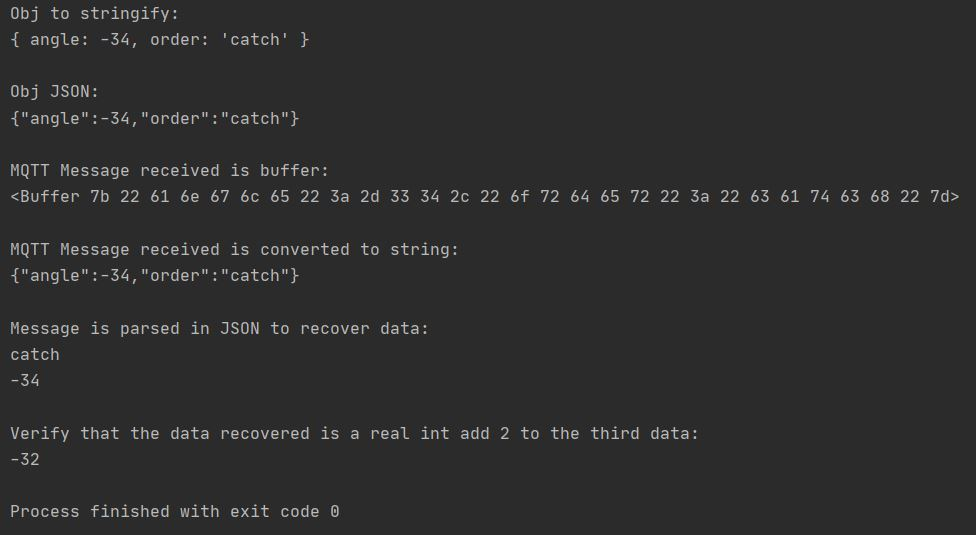

# Tuto-mqtt-js
This is a quick tutorial for mqtt in Java Script

If you have any question: *florian.hueber@edu.ece.fr*
##

**BEFORE TRYING TO RUN THE CODE !!!**
1) install a JS IDE (Webstorm: https://www.jetbrains.com/webstorm/)
2) install node.js (https://nodejs.org/en/)
3) install npm mqtt.js (type in the terminal: *npm install mqtt --save*)

#####Change 'blabla' inside the single quote by your id, pwd, topic

 - id: with your squad id (Path Planning, Vision Control, Robot)
 - pwd: with your squad pwd (Path Planning, Vision Control, Robot)
 - topic: with the topic you want to publish on, you can refer to the end of the first semester rules document to find it
 
 #####Expected output:
